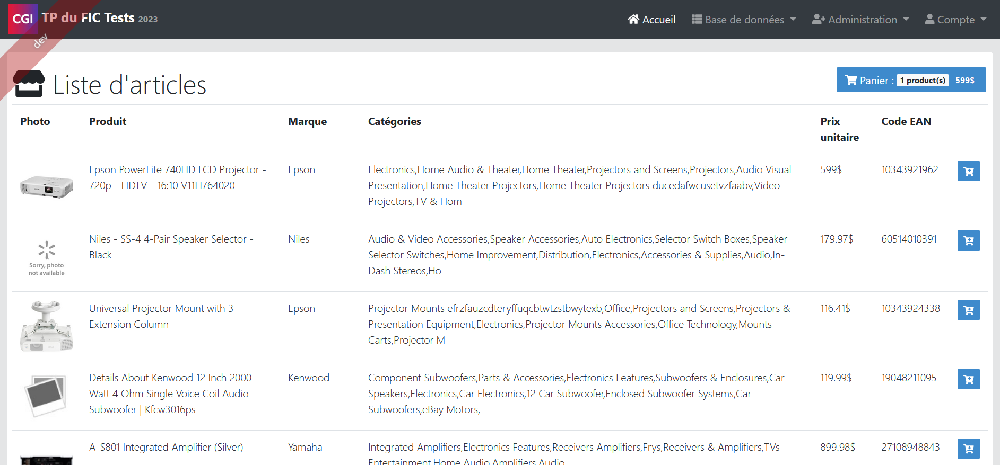
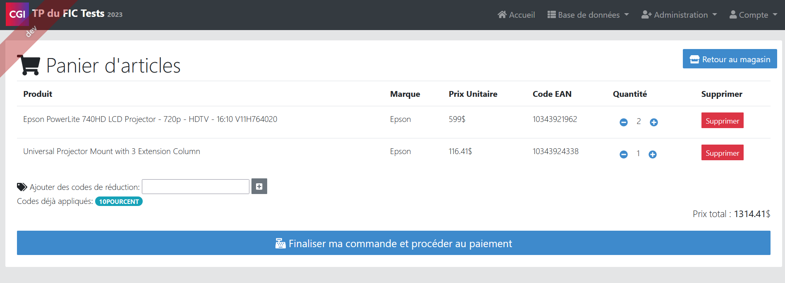
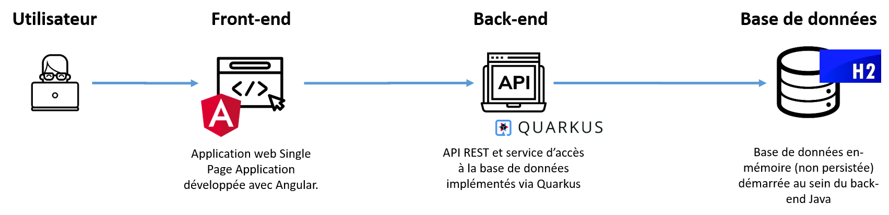

# TP du FIC Testing

_Edition 2023 - Avec Quarkus et Angular_

## 1. Présentation

### 1.1. Contexte

L'application qui va être utilisée pour se former à la réalisation de tests automatisés, est une implémentation très simplifiée d'un site web marchand, une marketplace électronique.
Vous allez vous focaliser sur la fonctionnalité d'ajout / retrait de produits dans un panier d'achat avec calcul du prix total du panier.

### 1.2. Processus

L'application se compose de 2 écrans pour l'instant:

- le premier écran permet de lister les produits disponibles sur le site marchand, d'en consulter les informations et de les rajouter au panier. L'ajout au panier se fait via une icône bleue "Ajout au panier" localisée dans la dernière colonne à droite du tableau. Dès qu'au moins un produit est ajouté au panier, alors un encart Panier apparaît en haut à droite et permet d'obtenir le coût total du panier ainsi que le nombre d'articles ajouté. En cliquant sur cet encart panier, vous pouvez accéder à votre panier d'achat.

- le deuxième écran est le panier d'achat. Il permet de visualiser la liste des articles ajoutés au panier, d'ajouter ou supprimer des articles ainsi que d'ajouter un éventuel code de réduction. Vous pouvez utiliser par exemple l'un de ces codes de réduction: DIXPOURCENT (-10%), ONVIDETOUT (-50%). Veuillez noter que la fonctionnalité de finalisation de l'achat n'est pas incluse dans le périmètre de l'exercice.

### 1.3. Architecture

L'architecture de l'application est celle d'une application web moderne classique en 3 tiers. Elle se compose d'un front-end Angular qui est une Single Page Application chargée dans le navigateur de l'utilisateur. Cette application web Angular accès à un back-end Quarkus. Quarkus est un framework Java permettant d'implémenter des services web très performants au temps de démarrage très rapide. Enfin la base de données est implémentée grâce à H2 qui est une base de données chargée uniquement en mémoire au sein de la Java Virtual Machine du back-end.

### 1.4. Entités mise en oeuvre

Ce projet met en oeuvre 4 entités métier:

- l'entité **Product** (produit) qui matérialise un produit achetable
- l'entité **Discount Code** (code de réduction) avec le champ discount qui est le pourcentage de réduction applicable au panier
- l'entité **Basket** (panier d'achats) qui matérialise un panier d'achat et contient le champ "totalPrice" qui est calculé à partir des produits ajoutés au panier
- l'entité **ProductInBasket** (produit dans le panier) qui contient la liste des produits ajoutés au panier et leur quantité

## 2. Préparation

### 2.1. Démarrage de votre GitPod

GitPod est un environnement de développement en ligne qui permet d'obtenir un environnement de développement à la volée implémenté grâce à Docker et un IDE Visual Studio Code en ligne. C'est l'environnement que nous utiliserons pour ce TP.

Pour démarrer votre GitPod, vous pouvez cliquer sur le lien ci-dessous:
https://gitpod.io/#/https://github.com/juliencognet/FicTesting2023Quarkus

Il vous faudra créer un compte sur Github pour utiliser GitPod. Vous disposerez de 50h d'utilisation gratuite par mois.

Une fois le conteneur créé, laissez GitPod initialiser l'environnement.

### 2.2. Lancement de l'application

Dans l'onglet Terminal, créez un nouveau terminal de type bash, puis lancez ./mvnw

Quand l'application aura démarrée, vous verrez dans le terminal

` 2023-02-21 13:47:37,043 INFO [io.quarkus] (Quarkus Main Thread) fic-tests-2023 1.0.0-SNAPSHOT on JVM (powered by Quarkus 1.12.1.Final) started in 5.415s. Listening on: http://localhost:8080`

Dans un nouveau terminal, tapez :
`gp url 8080` pour récupérer l'url à appeler pour accéder à votre application. Elle devrait se présenter sous la forme https://8080-juliencogne-fictesting2-2rs0l0ld3ak.ws-eu87.gitpod.io/

L'application démarre en mode liveReload. C'est-à-dire que tous les changements apportés sur le back-end java sont répercutés quasi immédiatement sur l'application.

### 2.3. Lancement des tests unitaires

A gauche de votre IDE, la dernière icone se présente sous la forme d'un bécher de laboratoire. C'est la section testing. Elle vous permet d'exécuter tout ou partie des tests de l'application. Les tests de l'application sont dans `src/test/java`.

## 3. Exercices

### 3.1. Tests exploratoires

Naviguez dans l'application, essayez toutes les fonctionnalités et procédez à des tests exploratoires.

> Quelles anomalies avez-vous détectée (2 ont été identifiées par les formateurs) ?
>
>    

>    
Solution

>    En cas d'ajout du même produit dans le panier, un doublon se crée au lieu d'incrémenter la quantité de cette référence.
>    Le calcul du panier ne prend pas en compte les bons de réduction qui sont ajoutés sur le panier.
>    

### 3.2. Correction de l'anomalie de mise en panier d'un produit

Nous proposons de corriger l'anomalie que vous avez dû détecter lors de l'ajout d'un produit dans le panier.

Pour bien comprendre le problème, nous vous invitons à vous connecter en "admin" dans l'application web et visualiser l'état en base de données. Regardez en particulier l'entité "Product In Basket". Que constatez-vous ?

>    

>    
Solution

>    Lorsqu'on ajoute 2 fois le même produit à un panier, l'application crée 2 lignes plutôt que modifier la quantité du produit dans le panier existant.
>    

> Comment allez-vous procéder ? Quelle méthodologie voulez-vous adopter ?
>
>    

>    
Solution

>    Le Test Driven Development est particulièrement adapté à la prise en compte d'anomalies puisqu'il sécurise le développement existant et s'assure que l'anomalie ne sera pas reproduite à l'avenir (non-régression)
>    

Nous vous proposons désormais d'analyser le code correspondant à cette anomalie.

> Quelles sont les méthodes concernées ? Aidez-vous des outils de développements de votre navigateur (touche F12) pour retrouver l'appel REST qui est réalisé. Ensuite, dirigez-vous vers le package `com.cgi.fic.tests.web.rest`.
>
>    

>    
Solution

>    La méthode web.rest.ProductInBasketResource.createProductInBasket appelle la méthode service.ProductInBasketService.save qui appelle repository.productInBasketRepository.persistOrUpdate
>    

Retrouvez désormais le test associé à cette méthode. Il faut le chercher dans `src/test/java`.

>    

>    
Solution

>    Les tests de la classe web.rest.ProductInBasketResource se trouvent dans src/test/java/com/cgi/fic/tests/web/rest/ProductInBasketResourceTest.java.
>    

Exécutez ces tests. Pour cela, il y a 2 façons de le faire:

- Cliquer sur le bouton "Run test" localisé à gauche du titre de la classe `public class ProductInBasketResourceTest {`
- Aller dans le plugin "Testing" (icone becher à gauche) et exécuter les tests de la classe en question.

Ces tests sont-ils suffisants ?
Quel test rajouter ? Comment voulez-vous le nommer ?

>    

>    
Solution

>    `public void givenOneEmptyBasketWhenIAddTwoTimesTheSameProductThenBasketShouldContainOnlyOneRowWithAQuantityOfTwo() { }`
>    

Attention, y a t il seulement un seul test à créer ? Regardez en particulier les 3 attributs obligatoires de la classe ProductInBasket. Vous en déduirez au moins 2 autres tests à créer.

>    

>    
Solution

> givenTwoEmptyBasketsWhenIAddTheSameProductToBothBasketsThenTheTwoBasketsShouldContainOnlyOneRowWithAQuantityOfOne ET givenOneEmptyBasketWhenIAddTwoDifferentProductsInBasketThenTheBasketsShouldContainTwoRowsForTheTwoProductsWithAQuantityOfOne
>    

Pour implémenter ces 3 tests, inspirez-vous de la méthode createProductInBasket().

Exécutez vos nouveaux tests. Que constatez-vous ?

>    

>    
Solution

> Les tests échouent. Bravo, vous avez réussi la première phase du TDD : écrire des tests qui échouent car le code n'est pas encore implémenté.
>    

Corrigez désormais la classe incriminée.

### 3.3. Correction de l'anomalie

Après analyse, pensez-vous que l'organisation du code actuelle vous permet d'implémenter ce nouveau contrôle de façon adéquate ?

> Quelle réorganisation (refactoring) proposez-vous ?
>
>    

>    
Solution

>     Implémenter une nouvelle méthode addProductToBasket dans la classe de service (ProductInBasketService). Cette méthode procède au contrôles fonctionnels (dont le contrôle de doublon) et appelle la méthode save de ce même service. Dans la classe rest, il faudra donc appeler la méthode addProductToBasket du service.
>    

### 3.4. Maintenabilité des tests créés

Que pensez-vous de la maintenabilité des tests que vous venez de créer ?

>    

>    
Solution

>  Vous venez de faire du copier / coller. Les tests deviennent difficiles à maintenir. C'est là qu'il convient de faire du test paramétré. C'est-à-dire faire en sorte de passer en paramètre du test les identifiants de panier et les identifiants de produits qui seront rajoutés au panier ainsi que les résultats attendus.
>    

## 4. Implémentations de tests de type Behavior Driven Development avec Cucumber
